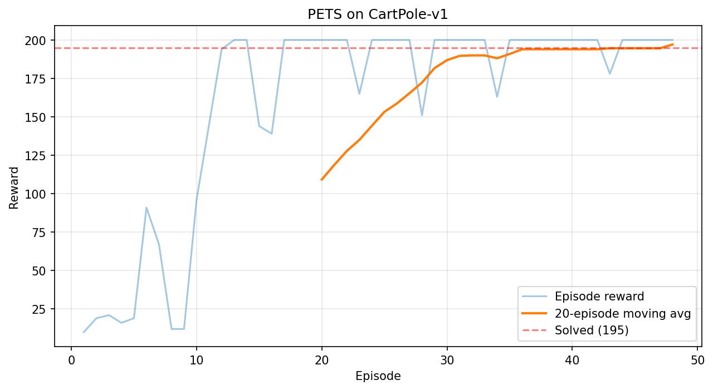
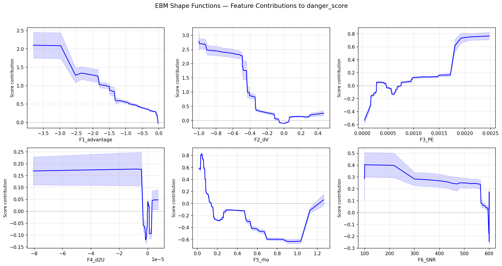

# RL Testing: PETS + EBM 危险分数引导搜索

学习到的 **danger score（危险分数）** 能否引导搜索算法比随机测试更快地找到导致故障的 episode？

本项目实现了一个完整的实验流水线来回答这个问题，使用：
- **PETS**（Probabilistic Ensemble Trajectory Sampling）作为被测试的 RL 智能体
- **EBM**（Explainable Boosting Machine）作为危险评分器
- **改编自 STARLA 的遗传算法**作为引导搜索策略
- **CartPole-v1** 作为测试环境

## 实验目标

**Goal 1**：证明 `danger_score = EBM(F1...F6)` 能够独立引导遗传搜索，比随机测试更快地找到导致故障的 episode。

- 适应度函数：**仅使用** `danger_score` -- 不使用奖励、故障概率或置信度
- 不使用扰动通道（E1-E4）
- 搜索框架：改编自 STARLA 的多目标遗传算法

## 流水线概览

```
阶段 0：种子数据
  PETS 智能体 --> 在 CartPole 上训练 --> 训练好的集成模型 + 规划器

阶段 1：特征 + 评分器
  Episodes --> 提取 F1-F6 --> 训练 EBM --> danger_score
                             --> 训练 CORELS --> 可解释规则

阶段 2：引导搜索 (G1) vs 随机基线 (G0)
  G1：遗传算法进化初始状态扰动以最大化 danger_score
  G0：相同预算下的随机扰动

阶段 3：评估
  对比 G0 vs G1：故障率、累积故障数、效率曲线
```

## 项目结构

```
RL_Testing2/
├── experiments/
│   ├── configs/
│   │   └── pets_cartpole.py          # 超参数配置 (EasyDict)
│   ├── agents/
│   │   ├── ensemble_model.py         # 概率集成动力学模型 (5 成员, 2x64)
│   │   ├── cem_planner.py            # CEM 规划器 (离散 Bernoulli, 热启动, TS-1)
│   │   └── pets_agent.py             # PETS 训练循环 + rollout
│   ├── features/
│   │   └── feature_extractor.py      # 每时间步 6 个危险相关特征
│   ├── models/
│   │   ├── train_ebm.py              # 训练 EBM 分类器
│   │   ├── train_corels.py           # 训练 CORELS 规则列表（可解释性）
│   │   ├── danger_scorer.py          # 封装 EBM 作为 GA 适应度（logit 变换）
│   │   └── validate_consistency.py   # 交叉验证 EBM 与 CORELS 一致性
│   ├── search/
│   │   ├── genetic_search.py         # 单目标遗传算法（改编自 STARLA）
│   │   └── random_baseline.py        # G0 随机搜索基线
│   ├── evaluation/
│   │   ├── run_goal1.py              # G0 vs G1 多次重复实验
│   │   ├── plot_efficiency.py        # 生成效率曲线（Figure 1）
│   │   └── generate_table1.py        # 生成 CORELS 规则（Table 1）
│   ├── utils/
│   │   ├── episode.py                # Episode 数据结构 + ReplayBuffer
│   │   └── env_wrapper.py            # CartPole 状态保存/恢复
│   ├── train_pets.py                 # 脚本：训练 PETS 智能体
│   ├── collect_episodes.py           # 脚本：采集 600+ episodes
│   ├── extract_features.py           # 脚本：提取特征矩阵
│   ├── data/                         # 运行时产物（检查点、episodes、特征、结果）
│   ├── outputs/                      # 图表输出
│   └── ARCHITECTURE.md               # 详细架构设计文档
├── DI-engine/                        # OpenDILab DI-engine（子目录，--no-deps 安装）
├── STARLA/                           # STARLA 参考实现（子目录）
├── .devcontainer/                    # 开发容器，用于可复现的环境
└── requirements.txt                  # Python 依赖
```

## 特征定义 (F1-F6)

六个逐时间步特征，捕捉危险的不同方面：

| ID | 名称 | 计算方式 | 含义 |
|----|------|----------|------|
| F1 | Advantage（优势） | Q(s,a) - V(s) | 策略质量：负值 = 采取了次优动作 |
| F2 | dV（价值变化率） | (V_t - V_{t-k}) / k | 价值趋势：负值 = 局势正在恶化 |
| F3 | Prediction Error（预测误差） | \|\|predicted - actual\|\| | 模型可靠性：高 = 模型建模不佳的区域 |
| F4 | Uncertainty Accel（不确定性加速度） | d^2U/dt^2 | 恶化速度：正值 = 不确定性在加速增长 |
| F5 | Density（密度） | 平均 5-NN 距离 | 分布偏移：高 = 远离训练数据分布 |
| F6 | SNR（信噪比） | \|V\| / (U + eps) | 决策置信度：低 = 决策噪声大 |

## 当前实验结果

### 阶段 1：PETS 智能体训练

PETS 在约 35 轮迭代内解决 CartPole-v1（平均奖励 >= 195），配置如下：
- 5 成员概率集成模型，2x64 隐藏层，Swish 激活函数
- 随机射击规划器（CEM 仅 1 次迭代，500 个候选序列，规划 horizon 为 10）
- 高斯 NLL 损失 + logvar 截断，基于 holdout 的早停机制



### 阶段 2：Episode 采集

采集 600 个 episodes，其中 20% 的时间步使用随机动作扰动：
- 使用轻量规划器（100 个候选序列，horizon 为 8）加速采集
- 额外补充采集以确保故障 episode 数量 >= 50
- 保存训练参考状态用于 F5 密度计算

### 阶段 3：EBM 危险评分器

EBM 在 6 个特征上训练，使用 episode 级别的训练/测试划分（无数据泄漏）：

**EBM 形状函数** -- 每个特征对 danger_score 的贡献：



形状函数的关键发现：
- **F1（Advantage）**：强负相关 -- 优势值越低，危险越高
- **F2（dV）**：强负相关 -- 价值下降越快，危险越高
- **F3（Prediction Error）**：正相关 -- 预测误差越大，危险越高
- **F5（Density）**：密度较低（更接近训练数据）反而显示更高的危险贡献，可能反映了智能体的故障模式集中在训练分布边界附近
- **F6（SNR）**：低信噪比 = 更高危险，存在一个明显的阶跃转变

### 阶段 4：CORELS 可解释规则

CORELS 提取了人类可读的 if-then 规则来解释危险边界：

| 规则 | 条件 | 预测 | 准确率 |
|------|------|------|--------|
| 1 | IF F5_rho_low AND F2_dV_low AND F1_adv_low | 故障 | 93.3% |
| 2 | IF F5_rho_low AND F2_dV_low AND NOT F1_adv_low | 故障 | 84.7% |
| 3 | IF F5_rho_low AND NOT F2_dV_low AND F6_SNR_low | 故障 | 76.7% |
| 4 | IF F5_rho_low AND NOT F2_dV_low AND NOT F6_SNR_low | 故障 | 79.5% |
| 5 | IF NOT F5_rho_low AND F2_dV_low AND F3_PE_high | 故障 | 85.4% |

主导模式：**低密度（F5）结合价值下降（F2）** 是最强的故障预测组合。

### 阶段 5：G0 vs G1 搜索对比

实验设置：
- 种群大小：20，代数：20，预算：每次试验 420 个 episodes
- 5 次重复试验用于统计比较
- 扰动 sigma：0.05（G0 和 G1 相同）
- 两者均使用 CEM 规划器且无动作噪声 -- 唯一变量是初始状态扰动方式

遗传算法（G1）进化初始状态扰动以最大化 danger_score（logit 变换后的 EBM 输出），而 G0 在相同预算下使用随机扰动。

**逐试验结果：**

| 试验 | G0 故障数/总数 | G0 故障率 | G1 故障数/总数 | G1 故障率 |
|------|---------------|-----------|---------------|-----------|
| 1 | 166 / 420 | 39.52% | 162 / 420 | 38.57% |
| 2 | 178 / 420 | 42.38% | 173 / 420 | 41.19% |
| 3 | 148 / 420 | 35.24% | 164 / 420 | 39.05% |
| 4 | 152 / 420 | 36.19% | 166 / 420 | 39.52% |
| 5 | 170 / 420 | 40.48% | 155 / 420 | 36.90% |

**汇总统计：**

| 指标 | G0（随机） | G1（danger_score 引导） |
|------|-----------|----------------------|
| 平均故障率 | 38.76% ± 2.67% | 39.05% ± 1.39% |
| 平均故障数 | 162.8 | 164.0 |
| 提升幅度 | -- | +0.7% |

**分析：** 在当前实验设置下，G1（danger_score 引导）与 G0（随机测试）的故障发现能力非常接近，G1 仅有 0.7% 的微弱提升，统计上不显著。但值得注意的是 G1 的方差（±1.39%）明显低于 G0（±2.67%），说明引导搜索的结果更加稳定。

可能的原因及后续改进方向：
- CartPole-v1 的故障率本身较高（~39%），随机扰动即可大量触发故障，引导搜索的优势不易体现
- 初始状态扰动空间仅 4 维且范围有限（sigma=0.05, clip ±0.3），搜索空间较小
- 可考虑降低故障率（增大 max_steps、收紧终止阈值）或扩大扰动空间来增加任务难度

### 阶段 5 改进：5.5x 适应度放大（进行中）

针对第一轮实验 G1 几乎无提升的问题，对 danger_scorer 进行了改进 -- 将 success/failure 之间的适应度差距放大 5.5 倍，使 GA 有更强的选择梯度可以利用。

**改进效果：**
- 改进前：适应度集中在很窄的范围，GA 几乎无法有效进化
- 改进后：适应度展开至 1.1 ~ 1.3+，GA 开始有效进化
- Trial 2 中观察到 gen_fr（每代故障率）从 0.30 逐步上升到 0.65，说明 GA 确实在朝高危方向进化
- Trial 3 出现首个明显的 G1 胜出：G1=164 > G0=148

**实验状态：** 5 次试验正在运行中（预计总时长 ~30-40 分钟），已完成的试验结果呈混合趋势，最终统计结果待全部完成后更新。

## 相对于 STARLA 的改编

| 方面 | STARLA 原版 | 本项目改编 |
|------|------------|-----------|
| 智能体 | 预训练 DQN (Stable-Baselines) | PETS（集成模型 + CEM 规划器） |
| 适应度 | 3 个目标（奖励、置信度、故障概率） | 单一目标：danger_score |
| 选择策略 | NSGA-II 偏好排序 | 单目标锦标赛选择 |
| 交叉操作 | 抽象状态匹配（Q 值分箱） | 状态扰动向量的均匀交叉 |
| 变异操作 | 仅扰动小车位置（维度 0） | 扰动任意状态维度 |
| 重新执行 | DQN predict | CEM plan |
| 存档条件 | 目标阈值 | 提前终止 = 故障 |

## 依赖

| 组件 | 用途 |
|------|------|
| PyTorch (CPU) | 集成动力学模型 |
| gymnasium | CartPole-v1 环境 |
| interpret (EBM) | 可解释提升分类器 |
| corels | 可证明最优规则列表 |
| DI-engine (--no-deps) | 集成模型训练的参考模式 |
| scikit-learn | NearestNeighbors (F5)、DecisionTree 备选 |
| numpy, scipy, matplotlib, pandas | 数值计算与绘图 |

## 快速开始

### 使用开发容器（推荐）

```bash
# 在 VS Code 中使用 Dev Containers 扩展打开项目，或者手动构建：
cd .devcontainer && docker build -t rl-testing ..
docker run -it -v $(pwd)/..:/workspace rl-testing bash
bash .devcontainer/post-create.sh
```

### 运行实验流水线

所有脚本应从项目根目录运行：

```bash
# 阶段 1：训练 PETS 智能体（CPU 上约 35 分钟）
python -m experiments.train_pets

# 阶段 2：采集 episodes（约 5 分钟）
python -m experiments.collect_episodes

# 阶段 3：提取特征（约 10 分钟）
python -m experiments.extract_features

# 阶段 4a：训练 EBM
python -m experiments.models.train_ebm

# 阶段 4b：训练 CORELS
python -m experiments.models.train_corels

# 阶段 4c：验证 EBM/CORELS 一致性
python -m experiments.models.validate_consistency

# 阶段 5：运行 G0 vs G1 实验
python -m experiments.evaluation.run_goal1

# 生成输出图表
python -m experiments.evaluation.plot_efficiency
python -m experiments.evaluation.generate_table1
```

## 参考文献

- **PETS**: Chua, K., et al. "Deep Reinforcement Learning in a Handful of Trials using Probabilistic Dynamics Models." NeurIPS 2018.
- **STARLA**: Attaoui, M.O., et al. "Black-box Safety Testing of Reinforcement Learning Agents." 2024.
- **EBM**: Nori, H., et al. "InterpretML: A Unified Framework for Machine Learning Interpretability." 2019.
- **CORELS**: Angelino, E., et al. "Learning Certifiably Optimal Rule Lists for Categorical Data." JMLR 2018.
- **DI-engine**: OpenDILab. https://github.com/opendilab/DI-engine
